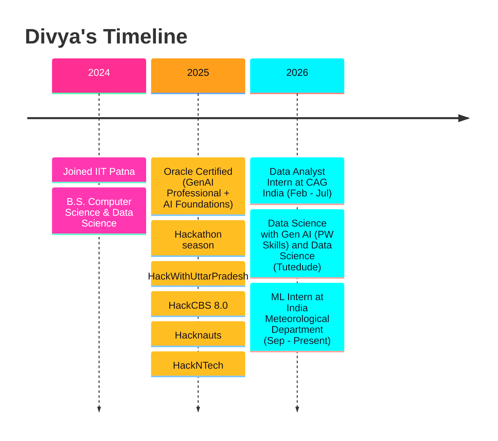
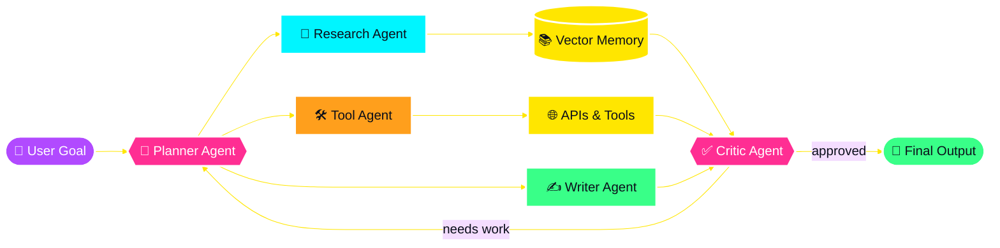
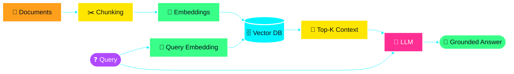
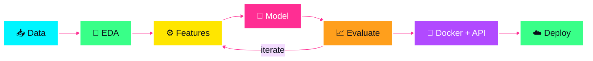
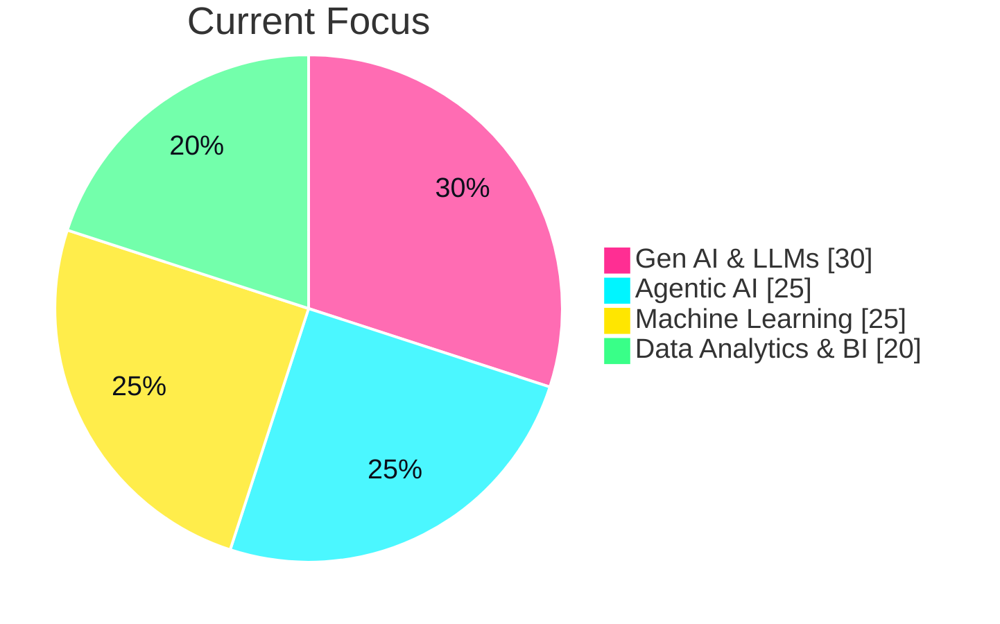
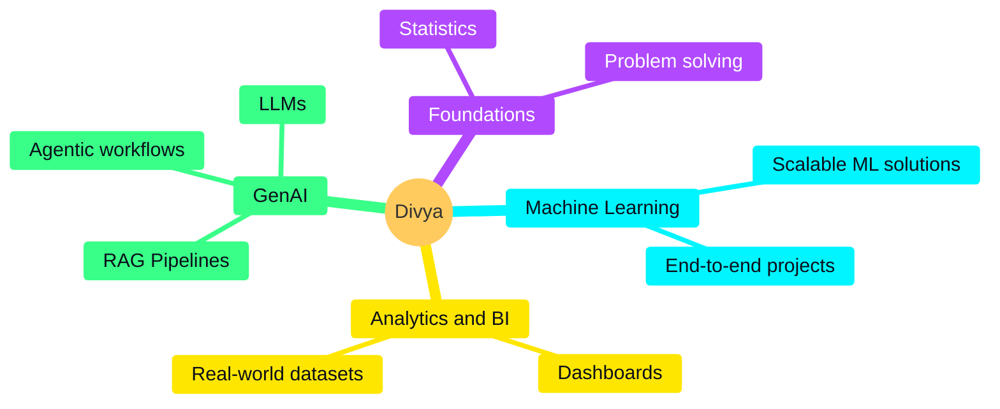

<!-- ===================== HEADER ===================== -->
<div align="center">


<a href="https://git.io/typing-svg">
  
</a>

<br><br>


<br><br>


</div>

<!-- ===================== ABOUT ===================== -->
<div align="center">

</div>


```python
class DataScientist:
    def __init__(self):
        self.name = "Divya"
        self.role = ["Data Analyst", "Business Analyst", "ML Engineer"]
        self.education = "B.S. Computer Science & Data Science @ IIT Patna"
        self.cgpa = 9.47
        self.currently = "ML Intern @ India Meteorological Department"
        self.achievements = [
            "🏆 5 Hackathons won",
            "🥈 HackWithUttarPradesh · HackCBS 8.0 · Hacknauts · HackNTech",
        ]
        self.interests = [
            "Machine Learning", "Business Intelligence", "Generative AI",
            "NLP & Transformers", "Multi-Agent AI Systems", "LLMs",
        ]

    def current_focus(self):
        return {
            "building":  "End-to-end ML & Data Science projects",
            "learning":  "RAG, LLMs, Gen AI & Agentic AI",
            "exploring": "Multi-agent workflows & modern AI tooling",
        }

    def future_goals(self):
        return "A data scientist who solves real-world problems"
```

<br clear="both">

<div align="center"></div>

<!-- ===================== JOURNEY ===================== -->
<div align="center">

</div>



<div align="center"></div>

<!-- ===================== EXPERIENCE ===================== -->
<div align="center">

</div>

<table>
<tr>
<td width="50%" valign="top">

### 🌦️ Machine Learning Intern
**India Meteorological Department**


Applying machine learning to real-world meteorological data.

</td>
<td width="50%" valign="top">

### 📊 Data Analyst Intern
**Indian Audit & Accounts Department (CAG India)**


Data analysis in a government audit environment.

</td>
</tr>
</table>

<div align="center"></div>

<!-- ===================== HACKATHONS ===================== -->
<div align="center">


<br>


<br><br>


<br><br>

</div>

<!-- ===================== PROJECTS ===================== -->
<div align="center">

</div>

### 🤖 Gen AI & Agentic AI

<div align="center">

[](https://github.com/CodeBy-Divya/AI_Therapist)
[](https://github.com/CodeBy-Divya/AAROHAN--AI-Powered-Scholarship-Fellowship-Platform-)

[](https://github.com/CodeBy-Divya/Chatbot-with-RAG)
[](https://github.com/CodeBy-Divya/cold-email-generator)

[](https://github.com/CodeBy-Divya/Nexura-OS)
[](https://github.com/CodeBy-Divya/3-month-AI-engineer-journey)

</div>

### 📊 Data Analytics & Machine Learning

<div align="center">

[](https://github.com/CodeBy-Divya/Churn-Analysis-and-Customer-Intelligence)
[](https://github.com/CodeBy-Divya/AirBnb_Global_Performance_Dashboard)

</div>

<details>
<summary><b>More ML & SQL projects</b></summary>
<br>

| Project | Type |
|:---|:---|
| [Loan Status Prediction](https://github.com/CodeBy-Divya/Loan-Status-Prediction-using-Machine-Learning) | 🤖 Classification |
| [House Price Prediction](https://github.com/CodeBy-Divya/House-Price-Prediction-using-Machine-Learning) | 📈 Regression |
| [Diabetes Prediction](https://github.com/CodeBy-Divya/Diabetes-Prediction-using-Machine-Learning) | 🏥 Classification |
| [Wine Quality Prediction](https://github.com/CodeBy-Divya/Wine-Quality-Prediction-using-Machine-Learning) | 🍷 Classification |
| [Netflix SQL Analysis](https://github.com/CodeBy-Divya/Netflix_SQL_Project) | 🗄️ SQL |
| [Retail Sales Analysis](https://github.com/CodeBy-Divya/Retail-Sales-Analysis-using-SQL) | 🗄️ SQL |

</details>

<div align="center"></div>

<!-- ===================== DIAGRAMS ===================== -->
<div align="center">

</div>

### 🧩 Multi-Agent AI System



### 🧠 RAG Pipeline



### 🔄 End-to-End ML Workflow



### 🎯 Where My Time Goes



### 🌱 What I'm Actively Building



<div align="center"></div>

<!-- ===================== TECH ===================== -->
<div align="center">


<h3>💻 Languages & Databases</h3>


<h3>🧪 ML, Deep Learning & Data</h3>


<h3>🌐 Backend & Frameworks</h3>


<h3>☁️ MLOps, Cloud & Tools</h3>


<h3>🤖 AI & LLM Engineering</h3>


<br><br>

</div>

<!-- ===================== EDUCATION ===================== -->
<div align="center">

</div>

<table>
<tr>
<td width="40%" valign="top">

### 🏛️ IIT Patna
**B.S. Computer Science & Data Science**


Machine Learning · Deep Learning

</td>
<td width="60%" valign="top">

| Certification | Issuer | Year |
|:---|:---|:---:|
| 🚀 Data Science with Gen AI | PW Skills | 2026 |
| 📊 Data Science | Tutedude | 2026 |
| ☁️ OCI Certified Generative AI Professional | Oracle | 2025 |
| 🧠 OCI Certified AI Foundations Associate | Oracle | 2025 |

</td>
</tr>
</table>

<div align="center"></div>

<!-- ===================== ANALYTICS ===================== -->
<div align="center">


<br>


<br>


<br>


<br><br>


</div>

### 🟡 Contributions Pacman

<picture>
  <source media="(prefers-color-scheme: dark)" srcset="https://raw.githubusercontent.com/CodeBy-Divya/CodeBy-Divya/output/pacman-contribution-graph-dark.svg">
  <source media="(prefers-color-scheme: light)" srcset="https://raw.githubusercontent.com/CodeBy-Divya/CodeBy-Divya/output/pacman-contribution-graph.svg">
  
</picture>

<div align="center"></div>

<!-- ===================== CONNECT ===================== -->
<div align="center">


<br>

<a href="https://www.linkedin.com/in/divya-singh-68910b32b/"></a>
<a href="mailto:divyasinghraghuvanshi31@gmail.com"></a>
<a href="https://www.instagram.com/divyana.raghuvanshi/"></a>
<a href="https://www.geeksforgeeks.org/profile/divyasinghra3xog"></a>

<br><br>

<a href="./Divya.Resume.pdf" target="_blank" rel="noopener noreferrer"></a>
<a href="https://github.com/CodeBy-Divya?tab=repositories" target="_blank" rel="noopener noreferrer"></a>

<br><br>

<a href="https://git.io/typing-svg">
  
</a>

</div>


